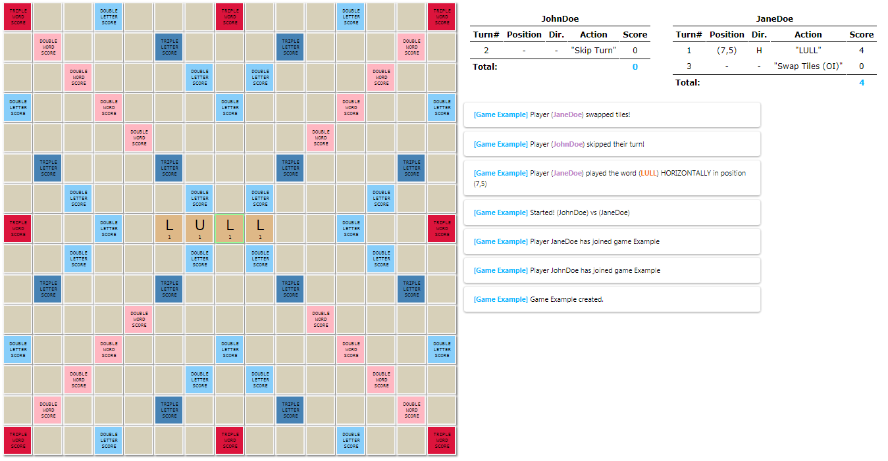

# Skrabble
This repository contains the API definition for the Skrabble server, as well as client implementations in various programming languages.



## Table of contents

- [Rules](#rules)
- [API](#api)
    - [Get Game State](#get-game-state)
    - [Join Game](#join-game)
    - [Delete Game](#delete-game)
    - [Play Word](#play-word)
    - [Swap Tiles](#swap-tiles)
    - [Skip Turn](#skip-turn)
- [FAQ](#faq)
- [Example Game Object JSON](#example-game-object-json)

## Rules

### Summary
Skrabble is a two-player word game played on a 15x15 **Board**. The goal of the game is to accumulate more points than your opponent by placing tiles on the board that spell out valid words from the SkrabbleDict.txt file.

### Game Start
At the start of the game, players are assigned a **Shelf** of **Tiles** drawn from the games **Tile Bag**. The **Tile Bag** starts with a fixed distribution of tiles, which can be found in the TileDistribution.txt file. **Tiles** each contain a single letter and a point value (with the exception of the ' ' tile). 

### Player Turns
During a players turn, they can perform one of the following actions.
- **Play** a word by placing tiles from their shelf onto the board
- **Swap** any number of tiles from their shelf with the tile bag
- **Skip** their turn

### Playing Words
When **Playing** a word, there are a few conditions that must be met.
- The first word played in a game must cross the **Start** tile
- All words other than the first must be either **Adjacent** to or intersect *at least* one existing tile on the board

### Scoring
After a word is played, its **Score** is determined by a number of factors.
- The point value word itself
- The point values of any new, **Adjacent** words created by placing tiles
- Any **Multipliers** that new tiles were placed on top of
- Executing a **Bingo** by playing all 7 tiles from the players tile shelf (+50 points)
    
### Win Condition
The game ends when both players each **Skip** or **Swap** two turns consecutively (four total). The **Final Score** is calculated as the sum of each players word scores, minus the point value of any tiles remaining on their tile shelf.

## API

### Get Game State 
Create a new game, or retrieve the state of an existing game.
  
**URL**
```
[GET] http://SkrabbleHost:8888/:gameId/game
```
**Params**

|Param|Valid Values|Description|
|-----|------------|-----------|
|gameId|string|Name of the game|

**Returns**

A Game object that represent the current state of the game, which includes Game Status, Turn State, Board State, Player Status, and Tile Bag.

**Example**

Requests the current state of TestGame
```url
[GET] http://SkrabbleHost:8888/TestGame/game
```

----  
### Join Game
Join a game awaiting players.
  
**URL**
```url
[GET] http://SkrabbleHost:8888/:gameId/join/:playerId
```
**Params**

|Param|Valid Values|Description|
|-----|------------|-----------|
|gameId|string|Name of the game|
|playerId|string|Name of a the player joining|

**Returns**

A Game object that represents the current state of the game *after* joining. 

**Example**

Player JohnDoe joins the game TestGame
```url
[GET] http://SkrabbleHost:8888/TestGame/join/JohnDoe
```  

----
### Delete Game
Delete an existing Skrabble game.
  
**URL**
```
[DELETE] http://SkrabbleHost:8888/:gameId/delete
```
**Params**

|Param|Valid Values|Description|
|-----|------------|-----------|
|gameId|string|Name of the game being deleted|

**Returns**

Nothing.

**Example**

Deletes the game TestGame
```url
[DELETE] http://SkrabbleHost:8888/TestGame/delete
```

----  
### Play Word
Play a word onto the board with a set of parameters. Requires the full word, including tiles already present on the board.
  
**URL**
```
[GET] http://SkrabbleHost:8888/:gameId/:playerId/playword/:x/:y/:direction/:word
```
**Params**

|Param|Valid Values|Description|
|-----|------------|-----------|
|gameId|string|Name of the game|
|playerId|string|Name of the player playing a word|
|x|integer *i* where 0<=*i*<15|X position of the start of the word|
|y|integer *j* where 0<=*j*<15|Y position of the start of the word|
|direction|HORIZONTAL or VERTICAL|Direction the word will be played on the board|
|word|string|Word being played, including tiles already on the board|

**Returns**

A Game object that represents the current state of the game *after* the word is played. 

**Example**

Player JohnDoe plays the word QUAKER starting at tile (7,5) horizontally in TestGame.
```url
[GET] http://SkrabbleHost:8888/TestGame/JohnDoe/playword/7/5/HORIZONTAL/QUAKER
```

----  
### Skip Turn
Skip a turn.
  
**URL**
```
[GET] http://SkrabbleHost:8888/:gameId/:playerId/skipturn
```
**Params**

|Param|Valid Values|Description|
|-----|------------|-----------|
|gameId|string|Name of the game|
|playerId|string|Name of a the player skipping|

**Returns**

A Game object that represents the current state of the game *after* the turn is skipped. 

**Example**

Player JohnDoe skips their turn in TestGame.
```url
[GET] http://SkrabbleHost:8888/TestGame/JohnDoe/skipturn
```

----
### Swap Tiles
Swap tiles from your shelf with tiles in the tile bag. Tiles are drawn before the tiles to be swapped are added back to the bag.
  
**URL**
```
[GET] http://SkrabbleHost:8888/:gameId/:playerId/swaptiles/:tiles
```
**Params**

|Param|Valid Values|Description|
|-----|------------|-----------|
|gameId|string|Name of the game|
|playerId|string|Name of a the player swapping tiles|
|tiles|string, length<=7|Tiles the player whiches to swap with the tile bag|

**Returns**
 
 A Game object that represents the current state of the game *after* the tiles are swapped. 

**Example**
 
 Player JohnDoe swaps the tiles "EAZ" for three random tiles in the tile bag in game TestGame.
```url
[GET] http://SkrabbleHost:8888/TestGame/JohnDoe/swaptiles/EAZ
```

## FAQ
* ***How does Double/Triple Letter/Word score get calculated?***

  Double/Triple Letter score tiles are always calculated before Double/Triple word score tiles. 

* ***If I play a word that intersects a tile that already had Double/Triple Letter/Word score, does it get counted again?***

  No. Score modifiers are only applied for new tiles. If a new tile is on a modifier, and creates  multiple words, the modifier will be applied to both words. 
  

## Example Game Object JSON
  ```
  {
  "_id":"test200",
  "state":"Starting",
  "turn": {
    "number":1,
    "player":"Player1"
    },
  "skipCounter":0,
  "playerOne":{
    "playerId":"Player1",
     "tileShelf":["U","R","I","O","K","E","I"],
     "score":0,
     "turns":[
      {
        "turn": 1,
        "pos": "(7,7)",
        "dir": "HORIZONTAL",
        "action": "AAEE",
        "score": 4
     ]
    }
  "playerTwo":{...},
  "board":[
      [
        {"coords":"(0,0)","modifier":"tripleWordScore","text":"TRIPLE WORD SCORE","tile":""}, ...],
        {"coords":"(0,1)","modifier":"","text":"","tile":"X"}, ...],
        ...
      ],
      [ ... ],
      ...
    ],
  "tileBag":["E","E", ... ,"X","Q","Z"],
  "tileSetProperties":[
      {"letter":"E","score":1,"count":12},
      {"letter":"A","score":1,"count":9},
      ...
    ]
  }
  ```
